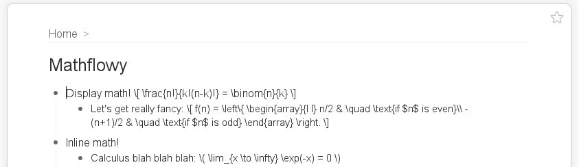
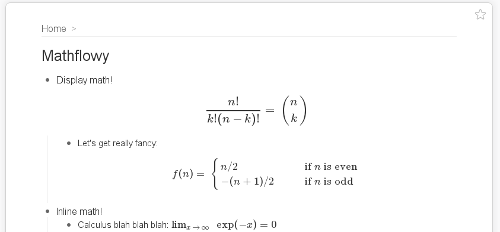

Mathflowy: MathJax equation rendering for Workflowy
===================================================

In a nutshell: Mathflowy = [MathJax](http://www.mathjax.com) + [Workflowy](http://www.workflowy.com). That is, it renders your fancy LaTeX math right within your beautiful Workflowy lists.

### Before ###

### After ###

Yes, it's really that simple.

Include _inline_ math by surrounding it with `\(` and `\)` (e.g., `\(2 + 2 = 5\)`).

Include _display_ math by surrounding it with `\[` and `\]` (e.g., `\[2 + 2 = 5\]`).

This is experimental and may break at any time, but hey, it hasn't erased any of my
data yet. :)
